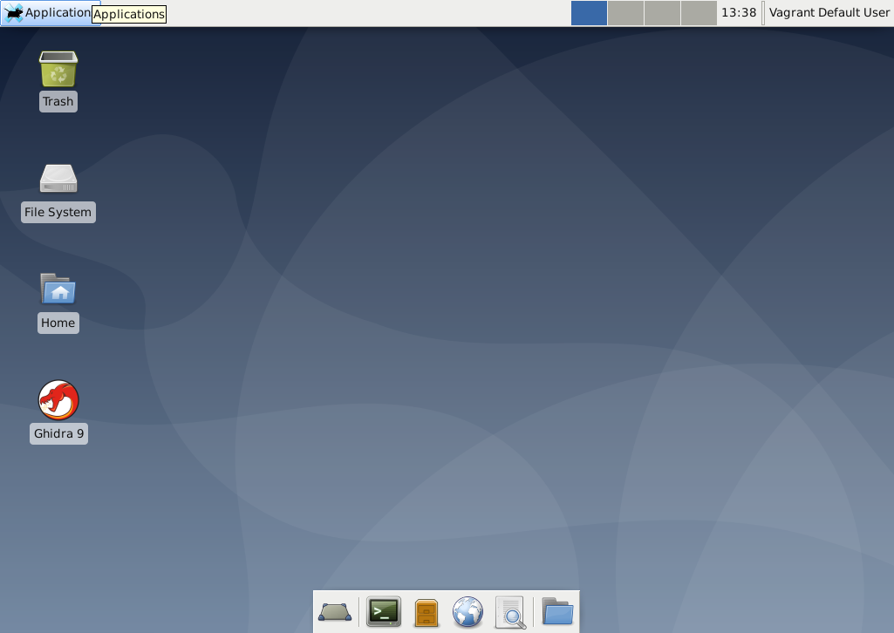
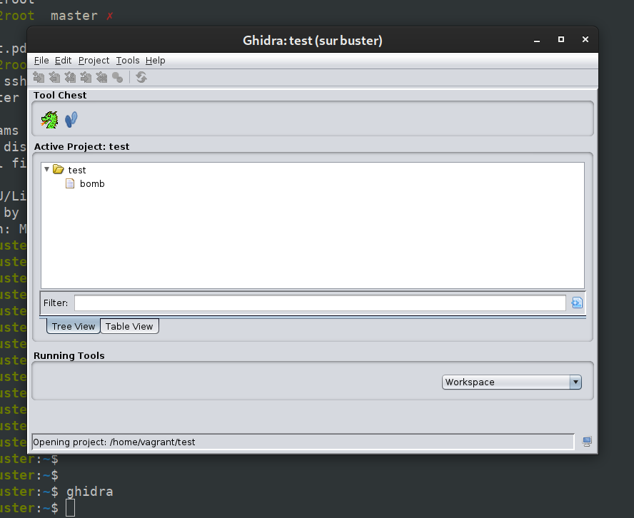

# Vagrant - Ghidra on Debian + XFCE


Don't want to install Ghidra on your computer?

Debian (+ xcfe) vagrant box with Ghidra already installed and configured. Support X11 forwarding 



v1.0:
- Ghidra 9.1.2
- Debian 10.4 + xfce
- VitualBox Guest Additions 6.1.12
- Gui enabled by default
- memory 4096
- vram 12

**If you just want to use the box, please use the [Vagrant Hub](https://app.vagrantup.com/nirae/boxes/ghidra) last stable version**

`vagrant init nirae/ghidra && vagrant up`

## Run

`vagrant up`

The current host directory `.` is synced with the guest directory `/vagrant`. By default with vagrant

### Disable Gui

If your os support X11 forwarding (if not, change it), you can disable the VM gui and launch only Ghidra graphically

```ruby
# -*- mode: ruby -*-
# vi: set ft=ruby :

Vagrant.configure("2") do |config|

    config.vm.box = "nirae/ghidra_debian"
  
    config.vm.provider "virtualbox" do |vb|
      vb.gui = false
    end
end
```

```sh
$ vagrant up
$ vagrant ssh
vagrant@buster:~$ ghidra 
```



### Changing some hardware parameters

Create or change the Vagrantfile

```ruby
# -*- mode: ruby -*-
# vi: set ft=ruby :

Vagrant.configure("2") do |config|

    config.vm.box = "nirae/ghidra_debian"
  
    config.vm.provider "virtualbox" do |vb|
      vb.customize ["modifyvm", :id, "--vram", "12"]
      # Customize the amount of memory on the VM:
      vb.memory = "4096"
      vb.cpus = 2
    end
end
```

Enjoy!

## Dev

Work on the main Vagrantfile, run it, change it, destroy it...

The `ghidra.desktop` and `ghidra.png` is for creating the desktop icon

/!\ Don't forget to restart the vagrant box after the first install to get the xfce desktop

### To remember...

Create the box:

`vagrant package --vagrantfile init/Vagrantfile`

/!\ Don't forget to link the init Vagrantfile

A `package.box` will be created

Add it to the vagrant boxes:

`vagrant box add nirae/ghidra_debian package.box`

Remove it:

`vagrant box remove nirae/ghidra_debian --all`

Let vagrant install the VirtualBox Guest Additions with the package `vagrant-vbguest`

`vagrant plugin install vagrant-vbguest`
